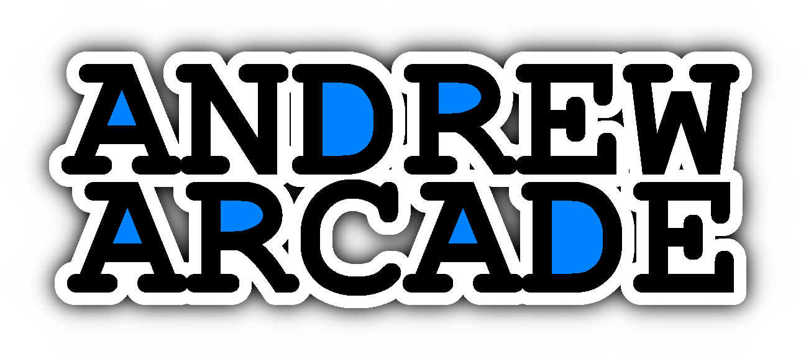

#

### About Andrew Arcade

Andrew Arcade is a custom game console running Linux on a Raspberry Pi 5. It is designed to run my own Unity games.

Version 2 is currently in development. This update focuses on moving from Linux to Android for better native support on ARM architecture. There is no set completion date for Version 2, but progress is being made steadily.

All of the codebases will be moved to this organization after the v2 update is complete.

### What is a Kevin?

Throughout the codebase, you might notice references to things called "Kevin." This might seem confusing at first, but it’s actually quite simple.

Referring to applications as "Andrew Arcade Apps" throughout the code felt clunky and repetitive. Even abbreviations like "AAA" or "Triple A" didn’t feel right. After some thought, I decided to use "Kevin" as a fun and unique codename for Andrew Arcade Apps. So, whenever you see "Kevin" in the code, just know it’s my shorthand for an Andrew Arcade App!