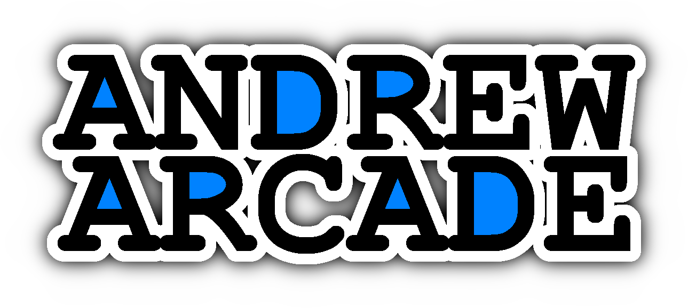

#

### About Andrew Arcade

Andrew Arcade is a custom game console built around a Raspberry Pi 5 running Linux. Its purpose is to play the games that I - and anyone else who wants to build for it - have made.

It is designed for makers who love both hardware and software. Every piece of it is open: the case, the controller PCB, the launcher, and the games.

### Hardware

The console is built around a Raspberry Pi 5. A screen and a controller plug straight in, and both are designed to be part of the device rather than accessories hanging off of it. Everything mounts inside a 3D printed case that houses the system cleanly.

The controller is a custom PCB built around a [Waveshare RP2040-Zero](https://www.waveshare.com/rp2040-zero.htm) running [GP2040-CE](https://github.com/OpenStickCommunity/GP2040-CE), an open source firmware that makes the board show up as a standard USB HID gamepad - no drivers, no configuration. Buttons and joysticks connect through simple JST connectors, so any of them can be swapped out without touching the board. The layout is a full gamepad: two analog joysticks and ten buttons covering Up/Down/Left/Right, A/B/X/Y, and Start/Option.

A full parts list lives in the [instructions](https://github.com/Andrew-Arcade/instructions/blob/main/BOM.md) repository.

### Software

The Pi runs [DietPi](https://github.com/MichaIng/DietPi), a minimal Debian based distribution for single board computers, so almost all of the system's resources go to the games.

On top of that sits the Driver - the console's home screen. It launches on startup and is the only thing you ever need to touch. From the Driver you can browse, install, update, remove, and launch your cabinets (our word for games and apps), and reboot, shut down, or update the console itself.

Cabinets are installed straight from their GitHub repositories. The Driver reads a registry of cabinet repos, pulls a standardized metadata file from each one, and installs the matching release - no SD card shuffling, no file managers. Metadata and icons are cached on the device, so the library still loads when the console is offline. Cabinets built for arm64 run natively; x86_64 builds run through [box64](https://github.com/ptitSeb/box64).

Setting all of this up sounds involved, but it isn't. Once DietPi is installed on the Pi, a single script handles the rest - users, autostart, file structure, GPU config, and dependencies:

```bash
curl -sSL https://raw.githubusercontent.com/Andrew-Arcade/driver/main/scripts/setup.sh | sudo bash
```

The [docs](https://github.com/Andrew-Arcade/docs) repository has the detailed walkthrough, plus everything you need to publish your own cabinet.

<hr>

By the way, we know the repos seem a bit all over, we are working to clean that up and consolidate.